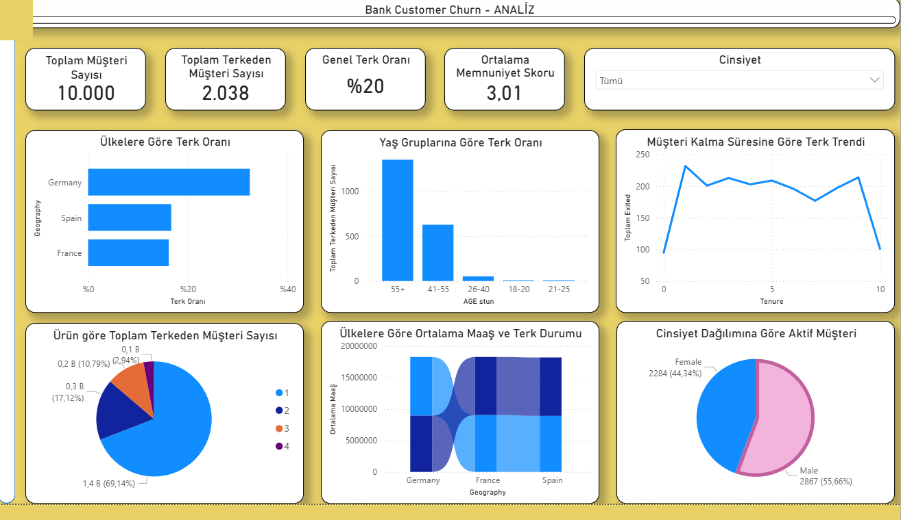
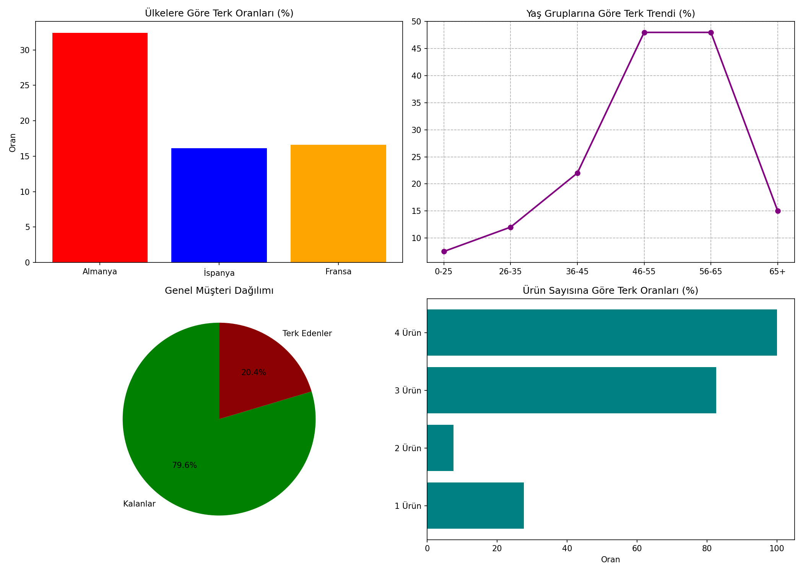

# 🏦 Banka Müşteri Churn Analizi

Python, Pandas, SQL ve Power BI kullanılarak 10.000 banka müşterisinin terk etme (churn) davranışı analiz edilmiştir.

---

## 📊 Power BI Dashboard




---

## 📁 Proje Yapısı

```
Bank-Customer-Churn/
├── data/
│   └── bank_churn.csv
├── gorseller/
├── PowerBI/
├── forcln.py        # Veri yükleme & temizleme
├── analiz.py        # Analiz soruları & hesaplamalar
├── gorseller.py     # Matplotlib grafikleri
├── sqlite.py        # SQL sorguları
└── README.md
```

---

## 🔍 Proje Hakkında

**Senaryo:**
> Bir bankanın müşteri kaybını analiz ediyoruz. Hangi müşteriler bankayı terk ediyor, neden terk ediyor?

**Veri Seti:** Kaggle — Bank Customer Churn Dataset
- 10.000 müşteri kaydı
- 14 özellik — yaş, ülke, kredi skoru, bakiye, aktiflik durumu vb.
- Hedef sütun: `Exited` (0 = kaldı, 1 = terk etti)

---

## 📈 Temel Bulgular

### Genel Terk Oranı
| Metrik | Değer |
|--------|-------|
| Toplam Müşteri | 10.000 |
| Terk Eden Müşteri | ~2.037 |
| Terk Oranı | %20.37 |

### Yaş Grubuna Göre Terk Oranı
| Yaş Grubu | Terk Oranı |
|-----------|-----------|
| 46-55 | En yüksek |
| 26-35 | En düşük |

### Ülkeye Göre Terk Oranı
| Ülke | Terk Oranı |
|------|-----------|
| Almanya | %32 |
| Fransa | %16 |
| İspanya | %17 |

### Kredi Skoru Analizi
| Grup | Ortalama Kredi Skoru |
|------|---------------------|
| Bankada Kalan | ~651 |
| Terk Eden | ~645 |

### Aktif Üye Analizi
- Aktif olmayan müşterilerin terk oranı aktif olanlara göre çok daha yüksek

### 💡 Önemli Bulgular
- **Almanya** diğer ülkelere göre 2 kat fazla müşteri kaybediyor
- **Orta yaş grubu (46-55)** en riskli segment
- **Aktif olmayan üyeler** bankayı terk etmeye çok daha yatkın
- Kredi skoru tek başına terk kararını açıklamıyor

---

## 🛠️ Kullanılan Teknolojiler

- **Python 3.12**
- **Pandas** — Veri analizi
- **NumPy** — Sayısal hesaplama
- **Matplotlib & Seaborn** — Görselleştirme
- **SQLite** — Veri sorgulama
- **Power BI** — İnteraktif dashboard

---

## 🚀 Kurulum

```bash
pip install pandas numpy matplotlib seaborn
```

```python
python forcln.py    # Veriyi yükler
python analiz.py    # Analizleri çalıştırır
python gorseller.py # Grafikleri oluşturur
python sqlite.py    # SQL sorgularını çalıştırır
```

---

## 👤 Geliştirici

**Adem Karpuz** — [github.com/Ademnj](https://github.com/Ademnj) | [linkedin.com/in/ademkzj](https://linkedin.com/in/ademkzj)